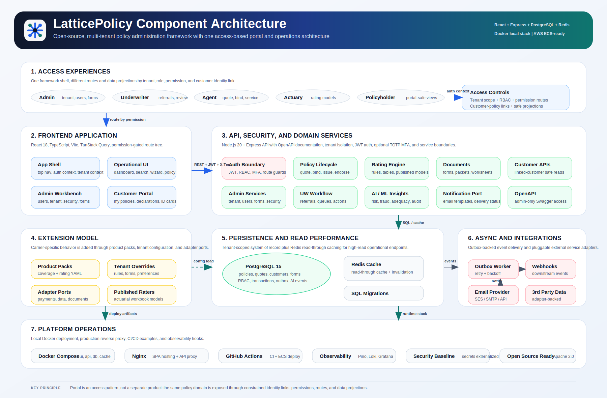

Architecture Overview (Carrier-Extensible, Multi-Tenant)

Goals
- Stable core with explicit extension points
- Tenant isolation: data, config, and behavior
- Safe upgrades: semantic versioning and migration contracts
- Productized LOB packs: Personal Auto and Homeowners
- Role-based experiences for internal users (admin/underwriter/actuary/agent) and end customers
- Reusable document and rating services across internal UI and customer portal

Architecture Style
- Hexagonal/clean architecture with domain-centric modules.
- Core services expose ports (interfaces) for rating, underwriting, documents, payments, and integrations.
- Adapters implement ports. Tenant plugins may provide adapter overrides within allowed extension points.

Modules
- Core Policy: policy lifecycle, effective-dated versions, transactions, premium breakdown.
- Product Packs: coverage model + rating inputs for Personal Auto and Homeowners.
- Customer Domain + Identity Links: customer master records, policy/customer relationships, user/customer linking, and portal-safe views.
- Authentication + Security: JWT auth, tenant isolation, RBAC, and optional tenant-level TOTP MFA.
- Rating Engine: rules + table-driven engine with pluggable calculators.
- Actuarial Rating Workbench: workbook import/version/publish APIs and published-model registry for product rating consumption.
- Document Service: template mapping to events (quote, issuance, endorsement, cancellation, renewal).
- Customer Portal Document Views: customer-facing declaration (policy-packet style) and ID-card PDF rendering with minimal coverage detail.
- Notification Service: outbound email delivery for transactional notices and system alerts.
- Workflow/UW: rule evaluation, referral reasons, and underwriter actions.
- AI/ML Decisioning: tenant-configurable inference for risk, fraud, premium adequacy, and recommendation outputs.
- Batch Processing: scheduled and asynchronous jobs for nightly processing and heavy workloads.
- Async Event Push: outbox-based message push for downstream systems (webhooks/event consumers).
- Cache Layer: Redis-backed read-through cache for high-read APIs and invalidation on admin updates.
- Observability: structured JSON logging with request correlation IDs.
- API Documentation Service: OpenAPI + Swagger UI (admin-only access).
- Integration Ports: payments, address validation, third-party data; adapters per tenant as needed.
- Extension Points: hooks for rating, UW rules, document selection, and event handlers.

UI Experience Design (Updated)
- Single frontend shell with permission-gated navigation and route-level access checks.
- Separate user experiences from the same platform:
  - Internal Operations UI (Search, Wizard, UW Queue, Admin, Rating)
  - End Customer Portal UI (minimal policy summary + customer-safe documents)
- Responsive design baseline:
  - Mobile navigation toggle
  - Table card-mode rendering on small screens
  - Wizard/admin layout collapse and horizontal step/tab overflow handling
- Device support target:
  - Desktop/laptop: primary
  - Tablet: supported
  - Phone: supported for key flows with simplified layouts (ongoing per-screen tuning)

Customer and User Relationship Design
- `customers` is the master identity entity and may relate to many policies and quotes.
- `policy_customer_links` stores policy/customer associations (primary/secondary/additional named insured and other roles).
- `users.customer_id` links a login user to exactly one customer record for end-customer portal access.
- `customer` RBAC role is restricted to customer portal APIs and UI routes only.
- Customer portal queries enforce:
  - tenant isolation (`tenant_id`)
  - linked-customer scope (user can only access their own linked customer data)
  - policy ownership check through `policy_customer_links`

Customer Portal Architecture (End Customer View)
- Purpose: minimal, customer-safe view of issued policies and current coverage summary.
- Backend APIs:
  - `GET /v1/customer-portal/summary` -> linked customer + portal-visible policies
  - `GET /v1/customer-portal/policies/:policyId` -> minimal declarations summary + ID card data
- UI behavior:
  - "My Policies" list shows policy number and product only (policy number opens summary)
  - Policy summary shows only current term, premium, coverages/limits/deductibles, and vehicle details
  - Declaration and ID Card views open as PDFs (customer-facing)
- Document behavior (current implementation):
  - Declaration is rendered as a policy-packet style PDF in the portal (on-demand generation)
  - ID Cards rendered as downloadable/viewable PDF for eligible products (Personal Auto)

Document Architecture (Operational + Customer-Facing)
- Internal document generation supports quote summary, policy packet, ID cards, and rating worksheet artifacts.
- Rating worksheet persistence:
  - `RATING_WORKSHEET` document metadata is stored in `documents` for persisted policy transactions
  - contains rating input/premium/calc-trace snapshot for actuarial/UW auditability
- Customer portal consumes minimal policy detail and renders customer-safe PDF views; it does not expose raw internal calc traces.

Effective-Dated Transaction Architecture (Out-of-Sequence Safe)
- Every policy transaction is immutable and must store:
  - `transaction_id`, `policy_id`, `transaction_type`, `status`
  - `effective_date` (business validity date), `processed_at` (system timestamp), `actor`
  - `change_set` (field-level operations, not full snapshot replacement)
  - `base_timeline_version` (timeline revision used when transaction was started/rated)
- The policy state is derived from a temporal timeline, not from "latest processed row only".
- Two time axes are used:
  - Valid Time: when change is effective on risk (`effective_date`)
  - System Time: when platform processed/issued it (`processed_at`)
- Deterministic precedence rules:
  1) Sort by `effective_date` ascending
  2) If same `effective_date`, sort by transaction sequence (or `processed_at`)
  3) Later valid-time change on same field wins for dates >= its effective date
- Derived read models:
  - `policy_state_as_of(date)` for quoting/endorsement simulation
  - `policy_state_current` for UI default
  - `policy_timeline_segments` with date windows (`segment_start`, `segment_end`) for pricing and audit

Out-of-Sequence Endorsement Processing
- When an endorsement is issued with an earlier effective date than existing issued transactions:
  1) Insert new immutable transaction with its own effective date.
  2) Rebuild timeline from the earliest impacted effective date.
  3) Replay all later effective-dated transactions in order.
  4) Recalculate premiums by impacted segment windows and produce retro debit/credit adjustments.
  5) Persist a new timeline revision; do not overwrite historical transactions.
- Conflict handling:
  - If two transactions modify same field at different effective dates, later effective date governs from that date forward.
  - If same effective date and same field, later sequence/processed transaction wins.
  - Mark replayed later transactions as `rebased` in metadata for traceability (no data loss).

Example (explicit dates)
- Policy term: `02/01/2026` to `02/01/2027`
- EN-1 issued effective `04/01/2026`: changes deductible.
- EN-2 later issued effective `02/01/2026`: changes a coverage limit.
- Resulting state:
  - `02/01/2026` to `03/31/2026`: base policy + EN-2 change
  - `04/01/2026` to term end: base policy + EN-2 + EN-1 changes (unless same field conflict, then EN-1 governs from `04/01/2026`)
- Billing output includes retro adjustment from `02/01/2026` to current processing date.

Data Model Additions (baseline)
- `policy_transactions`: add/standardize `effective_date`, `processed_at`, `sequence_no`, `base_timeline_version`, `timeline_version`.
- `policy_transaction_changes`: normalized field operations (`path`, `op`, `value_before`, `value_after`).
- `policy_timeline_segments`: materialized effective windows with snapshot hash and premium totals.
- `policy_retro_adjustments`: debit/credit entries produced by OOS recalculation.

API Expectations
- `POST /policies/{id}/endorse` requires `transactionEffectiveDate`.
- `GET /policies/{id}/state?asOf=MM-DD-YYYY` returns derived state for that date.
- `POST /policies/{id}/endorse/preview` returns impacted segments and estimated retro adjustment before issue.
- `GET /policies/{id}/timeline` returns ordered transactions + segment windows for audit/debug.
- `GET /v1/customer-portal/summary` returns linked customer issued policies for end-customer portal.
- `GET /v1/customer-portal/policies/{policyId}` returns customer-safe policy summary, coverage summary, and ID-card data.

Cache Management
- Engine: Redis (`redis:7-alpine`) with optional API fallback when unavailable.
- Read-through caching on high-read endpoints (tenant preferences, underwriting company lookup, forms preview).
- Targeted invalidation on configuration changes (tenant settings, underwriting company maintenance, forms admin mutations).
- TTL strategy: short-lived operational cache (roughly 1-5 minutes by endpoint criticality).
- Runtime controls: `CACHE_ENABLED`, `REDIS_URL`.

Logging Framework
- API logging uses `pino` + `pino-http` for low-overhead, structured JSON logs.
- Every request gets an `x-request-id` (accepts inbound header or generates one).
- Log level is configurable via `LOG_LEVEL` (default `debug` in non-prod, `info` in prod).
- Sensitive fields (authorization, cookies, passwords) are redacted.

Async Message Push (Outbox Pattern)
- Source events are written to `ledger_events` as part of transactional flows.
- A DB trigger enqueues a durable copy into `async_message_outbox` per event.
- A background worker claims pending rows (`FOR UPDATE SKIP LOCKED`) and pushes them asynchronously.
- Push target is configurable with `ASYNC_PUSH_WEBHOOK_URL` (or stdout fallback for local development).
- Failures are retried with exponential backoff; terminal failures are marked `Failed` with error details.
- Outbox rows retain tenant, topic, payload, attempts, and timestamps for audit/debug.
- Runtime controls: `ASYNC_PUSH_ENABLED`, `ASYNC_PUSH_POLL_MS`, `ASYNC_PUSH_BATCH_SIZE`, `ASYNC_PUSH_TIMEOUT_MS`.

Email Capabilities
- Transactional emails: quote-ready, bind confirmation, issue notices, cancellation/reinstatement communications.
- Channel adapters: AWS SES / SMTP / vendor API through an abstract notification port.
- Template rendering: tenant/product specific email templates with merge fields.
- Delivery tracking: message ID, status, retries, and correlation ID persisted for support/audit.
- Compliance controls: opt-out rules by communication type, throttling, and audit logging.

Batch Processing Capabilities
- Scheduler: cron-driven orchestration for recurring jobs (daily, hourly, monthly).
- Job Queue: durable queue for asynchronous workloads and retry handling.
- Workers: stateless worker processes that execute batch workloads per tenant.
- Job Registry: tracked job definitions, run history, status, and correlation IDs for audit/debug.
- Idempotency: job keys and checkpointing to prevent duplicate side effects.
- Retry/Backoff: transient failure retries with dead-letter handling.
- Tenant Safety: tenant-scoped execution context and data access in every job run.

Typical Job Types
- Renewal pre-processing and offer generation.
- Premium recomputation for queued policy changes.
- Forms/documents pre-generation and packet assembly.
- Scheduled email reminders and delivery retries.
- Data reconciliation and stale draft cleanup.
- Export/report generation.

Update Strategy
- Semantic versioning of Core and Product Packs.
- Backward-compatible extension point interfaces; deprecations announced with grace periods.
- Schema migrations versioned and idempotent; tenant data isolated via `tenant_id`.

Packaging
- Base Platform: `core/` domain + shared kernels.
- Product Packs: `products/personal-auto`, `products/homeowners` (coverage definitions, rate schemas, defaults).
- Tenant Plugins: `tenants/<tenant>/overrides` (config and optional low-code rule hooks).

Configuration Merge Order
Base Platform -> Product Pack -> Tenant Overrides -> Runtime Flags

MFA Capability
- Standard: OATH TOTP (RFC 6238) with 6-digit codes and 30-second time step.
- Tenant control: `mfaRequired` toggle in Admin -> Tenant settings (default OFF).
- Enrollment flow: when MFA is required and a user has not enrolled, login returns a setup challenge (manual key + otpauth URI); user confirms with first OTP to enable MFA.
- Login flow: username/password validation first, then OTP challenge/verify when tenant MFA is enabled.
- Backward compatibility: when tenant MFA is OFF, current login/admin behavior remains unchanged (no OTP required).

AI/ML Capability
- Tenant control: Admin -> Tenant -> AI / ML Configuration.
- Default behavior: AI disabled (`enabled=false`) and shadow mode enabled (`shadowMode=true`).
- Runtime behavior:
  - Quote rating computes `aiInsights` (risk score, fraud score, premium adequacy, recommendation, reasons, suggested actions).
  - Policy and customer views expose AI/ML insight panels (health, risk, retention/cross-sell style heuristics, product mix, trajectory).
  - Dashboard exposes AI insights and predictive summary widgets.
  - Rating and Premium steps display AI/ML insights after premium is rated (with pending banner before rating).
  - Insights are stored with quote snapshots (`quotes.ai_insights`) and returned by quote APIs.
  - Coverage-level premium allocation is exposed in AI insight payload for premium explainability.
- Auditability:
  - Inference events are written to `ai_inference_events` with provider/model/version, request/response payload snapshots, actor, and timestamp.
  - Tenant isolation is enforced via RLS policy on AI inference events.
- APIs:
  - `GET /v1/ai/settings`
  - `POST /v1/ai/quotes/insights`
  - `GET /v1/ai/dashboard/insights`
  - `GET /v1/ai/policies/{id}/insights`
  - `GET /v1/admin/customers/{idOrKey}/ai-insights`

Actuarial Rating Workbench and Published Rater Integration
- A dedicated `actuary` role and Rating UI tab provide a separate actuarial workspace within the same platform shell.
- Workbook framework supports:
  - import actuarial rating workbooks (e.g., Personal Auto examples)
  - versioned model storage
  - publish/activate workflow
  - published model API exposure
- Published model consumption:
  - product rating engine checks tenant/product/state published workbook model first
  - falls back to legacy rating logic when no published model is available
  - rating `calcTrace` captures model source, model code, and version label for explainability
- Rating Worksheet output:
  - generated after rating and visible in Forms/Documents
  - includes policy context, premium summary, coverage-level formula details, and structured calc trace table
  - persisted for issued policy transactions as `RATING_WORKSHEET` metadata

OpenAPI / Swagger Access Model
- Swagger UI (`/api-docs`) and OpenAPI spec (`/openapi.json`) are admin-only.
- UI "API Docs" navigation link is shown only for admin users.
- Swagger UI access from the browser uses the current auth token (query-token for docs endpoints only) to fetch the spec securely.
