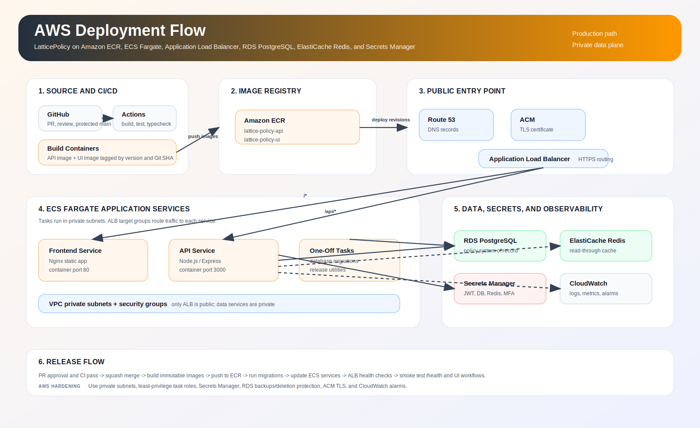
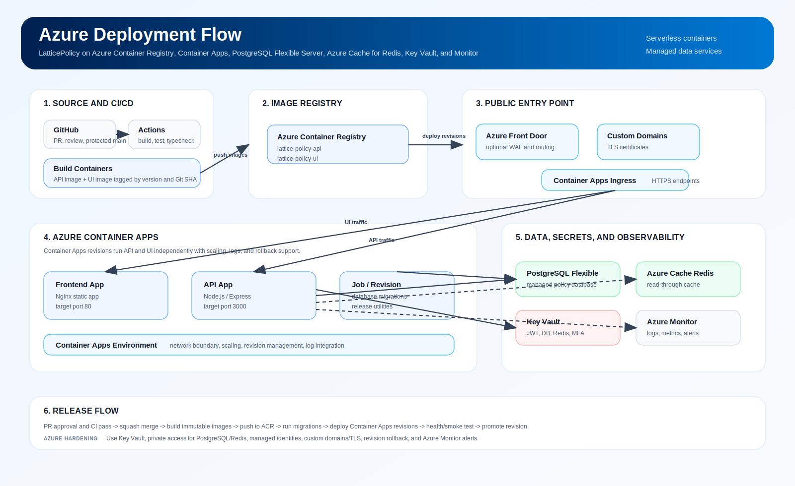
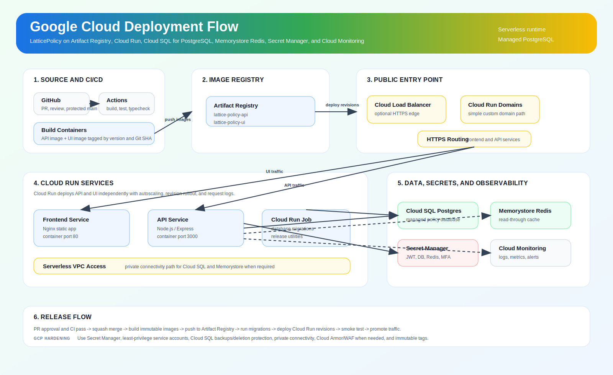

# Cloud Deployment Guide

This guide describes recommended production deployment patterns for LatticePolicy on AWS, Azure, and Google Cloud Platform. Each option deploys the same logical components:

- Frontend container: React/Vite static app served by Nginx
- API container: Node.js/Express service
- PostgreSQL database: policy system of record
- Redis cache: optional read-through cache
- Secrets: JWT, MFA, customer encryption, database credentials
- Public HTTPS entry point: routes browser traffic to the frontend and API
- CI/CD: builds container images and updates the runtime service

For production, avoid running PostgreSQL or Redis as unmanaged containers unless you have a clear operational reason. Prefer managed database/cache services, private networking, TLS, automated backups, and cloud-native secret storage.

## Required Runtime Configuration

API container environment variables:

| Variable | Required | Purpose |
| --- | --- | --- |
| `NODE_ENV=production` | Yes | Enables production runtime behavior. |
| `PORT=3000` | Yes | API container listen port. |
| `DATABASE_URL` | Yes | PostgreSQL connection string. |
| `JWT_SECRET` | Yes | Long random signing secret for auth tokens. |
| `CUSTOMER_DATA_KEY` | Recommended | Encryption key for customer-sensitive data. Defaults to `JWT_SECRET` if omitted. |
| `MFA_TOKEN_SECRET` | Recommended | Separate secret for MFA challenge tokens. |
| `MFA_ISSUER=LatticePolicy` | Recommended | Authenticator app issuer name. |
| `REDIS_URL` | Optional | Redis connection string. |
| `CACHE_ENABLED=1` | Optional | Enables Redis-backed cache when `REDIS_URL` is present. |
| `SENTRY_DSN` | Optional | Server-side error tracking DSN. |
| `ASYNC_PUSH_ENABLED` | Optional | Enables/disables async outbox worker. |
| `ASYNC_PUSH_WEBHOOK_URL` | Optional | Downstream webhook target for async events. |
| `ASYNC_PUSH_AUTH_HEADER` | Optional | Auth header used by async event push. |
| `LOG_LEVEL=info` | Recommended | Production log level. |

Frontend build variables:

| Variable | Required | Purpose |
| --- | --- | --- |
| `VITE_API_BASE_URL` | Yes | Public API base URL used by the browser app. |
| `VITE_SENTRY_DSN` | Optional | Browser-side error tracking DSN. |

Important: Vite variables are compiled into the frontend image at build time. If the API URL changes, rebuild and redeploy the frontend image.

## Container Images

Build two images:

```bash
docker build -t lattice-policy-api:0.1.0 -f server/Dockerfile .
docker build -t lattice-policy-ui:0.1.0 -f frontend/Dockerfile frontend \
  --build-arg VITE_API_BASE_URL=https://api.example.com
```

Recommended image tags:

- Immutable release tag: `0.1.0`, `0.1.1`, etc.
- Commit tag: Git SHA for traceability.
- Avoid relying on `latest` for production rollouts.

## AWS Deployment



Recommended AWS services:

- Amazon ECR for container images
- Amazon ECS on Fargate for API and frontend containers
- Application Load Balancer for HTTPS routing
- Amazon RDS for PostgreSQL
- Amazon ElastiCache for Redis
- AWS Secrets Manager or SSM Parameter Store for secrets
- Amazon CloudWatch Logs for container logs
- AWS Certificate Manager for TLS certificates
- VPC private subnets for ECS tasks, RDS, and Redis

### AWS Target Architecture

```text
Route 53 / DNS
  -> Application Load Balancer + ACM TLS
    -> /api/* target group -> ECS Fargate service: lattice-policy-api
    -> /* target group     -> ECS Fargate service: lattice-policy-ui

ECS private subnets
  -> RDS PostgreSQL
  -> ElastiCache Redis
  -> Secrets Manager / SSM Parameter Store
  -> CloudWatch Logs
```

### AWS Deployment Steps

1. Create an ECR repository for each image.

```bash
aws ecr create-repository --repository-name lattice-policy-api
aws ecr create-repository --repository-name lattice-policy-ui
```

2. Build and push images.

```bash
AWS_ACCOUNT_ID=<account-id>
AWS_REGION=us-east-1
API_IMAGE=$AWS_ACCOUNT_ID.dkr.ecr.$AWS_REGION.amazonaws.com/lattice-policy-api:0.1.0
UI_IMAGE=$AWS_ACCOUNT_ID.dkr.ecr.$AWS_REGION.amazonaws.com/lattice-policy-ui:0.1.0

aws ecr get-login-password --region $AWS_REGION \
  | docker login --username AWS --password-stdin $AWS_ACCOUNT_ID.dkr.ecr.$AWS_REGION.amazonaws.com

docker build -t $API_IMAGE -f server/Dockerfile .
docker build -t $UI_IMAGE -f frontend/Dockerfile frontend \
  --build-arg VITE_API_BASE_URL=https://api.example.com

docker push $API_IMAGE
docker push $UI_IMAGE
```

3. Provision PostgreSQL.

Use Amazon RDS for PostgreSQL in private subnets. Enable backups, encryption at rest, deletion protection for production, and security groups that allow inbound database traffic only from ECS task security groups.

4. Provision Redis.

Use Amazon ElastiCache for Redis in private subnets. Keep Redis inaccessible from the public internet.

5. Store secrets.

Use AWS Secrets Manager or SSM Parameter Store for:

- `DATABASE_URL`
- `JWT_SECRET`
- `CUSTOMER_DATA_KEY`
- `MFA_TOKEN_SECRET`
- `REDIS_URL`
- optional Sentry and async webhook secrets

6. Create ECS task definitions.

API task:

- Image: ECR API image
- Container port: `3000`
- Environment: `NODE_ENV=production`, `PORT=3000`, `CACHE_ENABLED=1`
- Secrets: `DATABASE_URL`, `JWT_SECRET`, `CUSTOMER_DATA_KEY`, `MFA_TOKEN_SECRET`, `REDIS_URL`
- Health check path: `/health`

Frontend task:

- Image: ECR frontend image
- Container port: `80`
- Health check path: `/`

7. Create ECS services.

Create one Fargate service for API and one for frontend. Attach each service to its Application Load Balancer target group.

8. Configure ALB routing.

Recommended routing:

- `https://app.example.com/*` -> frontend service
- `https://api.example.com/*` -> API service

Alternative single-domain routing:

- `https://example.com/api/*` -> API service
- `https://example.com/*` -> frontend service

If using single-domain routing, ensure frontend `VITE_API_BASE_URL` matches that public route.

9. Run database migrations.

Run migrations as a one-time ECS task or CI/CD deployment step before shifting traffic to the new API revision.

10. Configure observability.

Send container logs to CloudWatch Logs. Configure alarms for API 5xx errors, ALB target health, RDS CPU/storage, Redis memory, and ECS task restarts.

### AWS Production Checklist

- Use private subnets for ECS tasks, RDS, and Redis.
- Use ACM-managed TLS certificates.
- Use IAM task roles with least privilege.
- Use Secrets Manager/SSM for secrets, not plain task definition values.
- Enable RDS automated backups and deletion protection.
- Restrict database and Redis security groups to ECS tasks.
- Enable ALB access logs if required for audit.
- Use immutable image tags.

## Azure Deployment



Recommended Azure services:

- Azure Container Registry for container images
- Azure Container Apps for API and frontend containers
- Azure Database for PostgreSQL Flexible Server
- Azure Cache for Redis
- Azure Key Vault for secrets
- Azure Monitor / Log Analytics for logs
- Managed identities for workload access where practical
- Azure Front Door or Application Gateway for production edge routing when needed

### Azure Target Architecture

```text
DNS / Azure Front Door / Application Gateway
  -> Azure Container Apps: lattice-policy-ui
  -> Azure Container Apps: lattice-policy-api

Container Apps environment
  -> Azure Database for PostgreSQL Flexible Server
  -> Azure Cache for Redis
  -> Azure Key Vault
  -> Log Analytics
```

### Azure Deployment Steps

1. Create a resource group.

```bash
LOCATION=eastus
RESOURCE_GROUP=rg-lattice-policy-prod

az group create \
  --name $RESOURCE_GROUP \
  --location $LOCATION
```

2. Create Azure Container Registry.

```bash
ACR_NAME=<globally-unique-acr-name>

az acr create \
  --resource-group $RESOURCE_GROUP \
  --name $ACR_NAME \
  --sku Standard
```

3. Build and push images.

```bash
az acr login --name $ACR_NAME

ACR_LOGIN_SERVER=$(az acr show \
  --name $ACR_NAME \
  --resource-group $RESOURCE_GROUP \
  --query loginServer \
  --output tsv)

API_IMAGE=$ACR_LOGIN_SERVER/lattice-policy-api:0.1.0
UI_IMAGE=$ACR_LOGIN_SERVER/lattice-policy-ui:0.1.0

docker build -t $API_IMAGE -f server/Dockerfile .
docker build -t $UI_IMAGE -f frontend/Dockerfile frontend \
  --build-arg VITE_API_BASE_URL=https://api.example.com

docker push $API_IMAGE
docker push $UI_IMAGE
```

4. Create PostgreSQL Flexible Server.

Use Azure Database for PostgreSQL Flexible Server. For production, prefer private access through a virtual network, enable backups, and select high availability according to recovery requirements.

5. Create Azure Cache for Redis.

Keep Redis private to the application environment when possible.

6. Create Key Vault secrets.

Store:

- `DATABASE_URL`
- `JWT_SECRET`
- `CUSTOMER_DATA_KEY`
- `MFA_TOKEN_SECRET`
- `REDIS_URL`
- optional Sentry and async webhook secrets

7. Create Container Apps environment.

```bash
az extension add --name containerapp --upgrade
az provider register --namespace Microsoft.App
az provider register --namespace Microsoft.OperationalInsights

az containerapp env create \
  --name cae-lattice-policy-prod \
  --resource-group $RESOURCE_GROUP \
  --location $LOCATION
```

8. Deploy API container app.

```bash
az containerapp create \
  --name lattice-policy-api \
  --resource-group $RESOURCE_GROUP \
  --environment cae-lattice-policy-prod \
  --image $API_IMAGE \
  --target-port 3000 \
  --ingress external \
  --registry-server $ACR_LOGIN_SERVER \
  --env-vars NODE_ENV=production PORT=3000 CACHE_ENABLED=1 LOG_LEVEL=info
```

After creating the app, add secrets and secret-backed environment variables for `DATABASE_URL`, `JWT_SECRET`, `CUSTOMER_DATA_KEY`, `MFA_TOKEN_SECRET`, and `REDIS_URL`.

9. Deploy frontend container app.

```bash
az containerapp create \
  --name lattice-policy-ui \
  --resource-group $RESOURCE_GROUP \
  --environment cae-lattice-policy-prod \
  --image $UI_IMAGE \
  --target-port 80 \
  --ingress external \
  --registry-server $ACR_LOGIN_SERVER
```

10. Configure custom domains and TLS.

Use Container Apps custom domains directly for simpler deployments, or place Azure Front Door/Application Gateway in front for centralized routing, WAF, and TLS management.

11. Run database migrations.

Run migrations from a controlled deployment job, one-off container execution, or CI/CD step with access to PostgreSQL.

12. Configure monitoring.

Use Log Analytics and Azure Monitor alerts for failed revisions, high error rates, PostgreSQL metrics, Redis metrics, and HTTP latency.

### Azure Production Checklist

- Use private networking for PostgreSQL and Redis.
- Use Key Vault for secrets.
- Use managed identity where supported.
- Enable PostgreSQL backup and high availability for production.
- Configure custom domains and TLS.
- Use revision-based rollbacks in Container Apps.
- Configure Azure Monitor alerts.

## Google Cloud Platform Deployment



Recommended GCP services:

- Artifact Registry for container images
- Cloud Run for API and frontend containers
- Cloud SQL for PostgreSQL
- Memorystore for Redis
- Secret Manager for secrets
- Cloud Logging and Cloud Monitoring
- Cloud Load Balancing or Cloud Run domain mappings for public HTTPS

### GCP Target Architecture

```text
Cloud Load Balancing / Cloud Run domains
  -> Cloud Run service: lattice-policy-ui
  -> Cloud Run service: lattice-policy-api

Cloud Run
  -> Cloud SQL for PostgreSQL
  -> Memorystore for Redis
  -> Secret Manager
  -> Cloud Logging / Monitoring
```

### GCP Deployment Steps

1. Set project and region.

```bash
PROJECT_ID=<project-id>
REGION=us-central1
REPOSITORY=lattice-policy

gcloud config set project $PROJECT_ID
gcloud config set run/region $REGION
```

2. Enable required APIs.

```bash
gcloud services enable \
  run.googleapis.com \
  artifactregistry.googleapis.com \
  sqladmin.googleapis.com \
  redis.googleapis.com \
  secretmanager.googleapis.com \
  cloudbuild.googleapis.com
```

3. Create Artifact Registry repository.

```bash
gcloud artifacts repositories create $REPOSITORY \
  --repository-format=docker \
  --location=$REGION \
  --description="LatticePolicy container images"
```

4. Build and push images.

```bash
gcloud auth configure-docker $REGION-docker.pkg.dev

API_IMAGE=$REGION-docker.pkg.dev/$PROJECT_ID/$REPOSITORY/lattice-policy-api:0.1.0
UI_IMAGE=$REGION-docker.pkg.dev/$PROJECT_ID/$REPOSITORY/lattice-policy-ui:0.1.0

docker build -t $API_IMAGE -f server/Dockerfile .
docker build -t $UI_IMAGE -f frontend/Dockerfile frontend \
  --build-arg VITE_API_BASE_URL=https://api.example.com

docker push $API_IMAGE
docker push $UI_IMAGE
```

5. Create Cloud SQL for PostgreSQL.

Create a Cloud SQL PostgreSQL instance. For production, enable automated backups, deletion protection, private IP where appropriate, and choose a high availability configuration aligned with your recovery needs.

6. Create Memorystore for Redis.

Create a Memorystore Redis instance in the same region/VPC path used by Cloud Run. Use a Serverless VPC Access connector when private networking is required.

7. Store secrets in Secret Manager.

Store:

- `DATABASE_URL`
- `JWT_SECRET`
- `CUSTOMER_DATA_KEY`
- `MFA_TOKEN_SECRET`
- `REDIS_URL`
- optional Sentry and async webhook secrets

Grant the Cloud Run service account access to read only the required secrets.

8. Deploy API to Cloud Run.

```bash
gcloud run deploy lattice-policy-api \
  --image $API_IMAGE \
  --region $REGION \
  --platform managed \
  --port 3000 \
  --allow-unauthenticated \
  --set-env-vars NODE_ENV=production,PORT=3000,CACHE_ENABLED=1,LOG_LEVEL=info
```

Add secret-backed environment variables for production secrets. If using Cloud SQL private connectivity or Unix socket connectivity, configure the Cloud SQL connection and update `DATABASE_URL` accordingly.

9. Deploy frontend to Cloud Run.

```bash
gcloud run deploy lattice-policy-ui \
  --image $UI_IMAGE \
  --region $REGION \
  --platform managed \
  --port 80 \
  --allow-unauthenticated
```

10. Configure HTTPS routing.

Use Cloud Run service URLs for a simple deployment. For production, configure custom domains or use an external HTTPS load balancer to route frontend and API traffic.

11. Run database migrations.

Run migrations through a controlled Cloud Run job, Cloud Build step, or administrative workstation with database access.

12. Configure monitoring.

Use Cloud Logging and Cloud Monitoring alerts for API errors, Cloud Run instance failures, Cloud SQL CPU/storage/connections, Redis memory, and latency.

### GCP Production Checklist

- Use Artifact Registry, not ad hoc public image hosting.
- Use Secret Manager for secrets.
- Use Cloud SQL backups and deletion protection.
- Prefer private connectivity for database and Redis access.
- Use a dedicated Cloud Run service account with least privilege.
- Configure custom domains/TLS or HTTPS load balancing.
- Set Cloud Run minimum instances if cold starts are unacceptable.
- Use immutable image tags.

## Database Migrations

LatticePolicy currently stores SQL migrations under `server/migrations/`. Production deployment should run migrations as a deliberate release step before routing traffic to the new API version.

Recommended migration patterns:

- One-off cloud task/job with the API image and migration command.
- CI/CD deployment stage with network access to PostgreSQL.
- Manual DBA-controlled migration for regulated environments.

Do not run schema migrations from multiple API replicas at startup unless a migration lock/idempotency strategy is added.

## Security Baseline

For every cloud provider:

- Use HTTPS only.
- Store secrets in cloud secret management.
- Use private database/cache access where possible.
- Restrict inbound traffic to public entry points only.
- Use least-privilege runtime identities.
- Enable database backups and test restore procedures.
- Enable container logs and alerting.
- Use immutable image tags and retain build provenance.
- Keep `JWT_SECRET`, `CUSTOMER_DATA_KEY`, and database credentials out of GitHub Actions logs.
- Review customer portal APIs carefully because they expose customer-safe policy data.

## CI/CD Recommendation

Recommended release flow:

1. Pull request into `main`.
2. Required checks pass: build, test, typecheck.
3. Review and squash merge.
4. Build API and frontend images tagged with release version and Git SHA.
5. Push images to cloud registry.
6. Run database migrations.
7. Update API service.
8. Update frontend service.
9. Smoke test:
   - API `/health`
   - login
   - dashboard/search
   - quote workflow
   - customer portal route if enabled
10. Promote DNS/traffic after smoke tests pass.

## Official References

- AWS ECS with Application Load Balancer: https://docs.aws.amazon.com/AmazonECS/latest/developerguide/alb.html
- AWS ECR images with ECS: https://docs.aws.amazon.com/AmazonECR/latest/userguide/ECR_on_ECS.html
- Azure Container Apps quickstart: https://learn.microsoft.com/en-us/azure/container-apps/get-started
- Azure Container Registry documentation: https://learn.microsoft.com/en-us/azure/container-registry/
- Azure Database for PostgreSQL Flexible Server quickstart: https://learn.microsoft.com/en-us/azure/postgresql/flexible-server/quickstart-create-server
- GCP Cloud Run deploy containers: https://cloud.google.com/run/docs/deploying
- GCP Cloud Run with Cloud SQL for PostgreSQL: https://docs.cloud.google.com/sql/docs/postgres/connect-run
