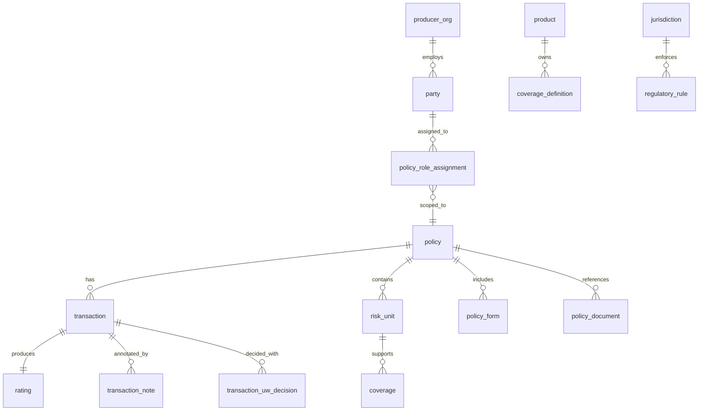

Policy Data Model & ERD (Relational PAS MVP)

Scope
- Relational schema targeted for Postgres (13+) while remaining portable to ANSI SQL databases.
- Product-agnostic kernel spanning policies, transactions, risk units, coverages, rating, forms, documents, parties, and RBAC assignments.
- Product facets for Personal Auto (PA) and Homeowners (HO) delivered via extension tables and metadata without altering the kernel tables.
- Supports dynamic UI, field-level RBAC, audit history, and event sourcing projections aligned with the prior system design.

Design Tenets
- Transaction-first lifecycle; policy rows capture the latest projection while transactions store every state change.
- Effective dating through transaction term fields and policy term columns, enabling endorsements, cancelations, reinstatements, rewrites, and renewals to co-exist.
- Global enablement via jurisdiction, currency, and locale references on policies and transactions.
- RBAC metadata stored in relational tables (`field_metadata`, `policy_role_assignments`) to drive form rendering and API enforcement.
- Immutable ledger backed by append-only `ledger_events`, with per-entity audit trail tables to satisfy compliance.
- Stable identifiers for parties, risk units, and coverages ensure deltas can be replayed or re-projected without breaking references.

Logical ERD
- party 1-* policy_role_assignment *-1 policy
- policy 1-* transaction *-1 rating
- policy 1-* risk_unit 1-* coverage
- policy 1-* policy_form
- policy 1-* policy_document
- transaction 1-* transaction_note
- transaction 1-* transaction_uw_decision
- product 1-* coverage_definition
- jurisdiction 1-* regulatory_rule
- producer_org 1-* party

Core Tables

policies
- Primary key: `policy_id uuid default gen_random_uuid()`
- Columns: `policy_number varchar(32) unique`, `status policy_status_enum not null`, `product_code varchar(10) not null`, `product_version varchar(20) not null`, `jurisdiction_code varchar(12) not null`, `currency_code char(3) not null`, `term_effective_date date not null`, `term_expiration_date date not null`, `term_type varchar(20)`, `insured_party_id uuid not null references parties(party_id)`, `lifecycle_created_at timestamptz not null`, `lifecycle_created_by uuid not null references parties(party_id)`, `lifecycle_updated_at timestamptz`, `external_id_legacy varchar(64)`, `external_id_carrier varchar(64)`, `premium_written numeric(14,2)`, `premium_earned numeric(14,2)`, `premium_fees numeric(14,2)`, `premium_taxes numeric(14,2)`, `premium_discounts numeric(14,2)`, `premium_surcharges numeric(14,2)`, `premium_total numeric(14,2)`, `projection_version int default 1`, `voided_at timestamptz`.
- Indexes: unique on `policy_number`, btree on `(status)`, `(insured_party_id)`, `(product_code)`, `(jurisdiction_code)`, `(term_effective_date, term_expiration_date)`.

policy_parties
- Purpose: policy-level party participation list.
- Primary key: `policy_party_id uuid`.
- Columns: `policy_id uuid not null references policies(policy_id) on delete cascade`, `party_id uuid not null references parties(party_id)`, `role_code varchar(32) not null`, `relationship varchar(32)`, `is_primary boolean default false`.
- Indexes: `(policy_id, role_code)`, `(party_id, role_code)`.

policy_role_assignments
- Primary key: `policy_role_assignment_id uuid`.
- Columns: `policy_id uuid not null references policies(policy_id) on delete cascade`, `party_id uuid not null references parties(party_id)`, `role_name varchar(32) not null`, `permissions text[] not null`, `scope jsonb` (for scoped permissions), `granted_at timestamptz not null`, `granted_by uuid references parties(party_id)`.
- Indexes: `(policy_id, party_id)`, `(party_id, role_name)`.

transactions
- Primary key: `transaction_id uuid`.
- Columns: `policy_id uuid not null references policies(policy_id) on delete cascade`, `transaction_type transaction_type_enum not null`, `status transaction_status_enum not null`, `jurisdiction_code varchar(12) not null`, `rating_date date`, `effective_date date not null`, `expiration_date date`, `change_set jsonb not null default '[]'`, `snapshot_risk jsonb`, `snapshot_coverages jsonb`, `snapshot_premium jsonb`, `rating_id uuid references ratings(rating_id)`, `created_at timestamptz not null`, `created_by uuid not null references parties(party_id)`, `voided_at timestamptz`.
- Indexes: `(policy_id, created_at desc)`, `(policy_id, status)`, `(transaction_type, status)`.

transaction_notes
- Primary key: `transaction_note_id uuid`.
- Columns: `transaction_id uuid not null references transactions(transaction_id) on delete cascade`, `note_type varchar(24) not null`, `note_text text not null`, `visibility text[] not null`, `added_by uuid not null references parties(party_id)`, `created_at timestamptz not null`.
- Indexes: `(transaction_id)`, `(note_type)`.

transaction_uw_decisions
- Primary key: `transaction_uw_decision_id uuid`.
- Columns: `transaction_id uuid not null references transactions(transaction_id) on delete cascade`, `rules_triggered text[]`, `decision decision_enum not null`, `conditions text[]`, `decided_by uuid references parties(party_id)`, `decided_at timestamptz not null`.
- Index: `(transaction_id)`, `(decision)`.

ratings
- Primary key: `rating_id uuid`.
- Columns: `policy_id uuid not null references policies(policy_id) on delete cascade`, `transaction_id uuid not null references transactions(transaction_id) on delete cascade`, `tables_version varchar(20)`, `inputs jsonb not null`, `total_premium numeric(14,2) not null`, `currency_code char(3) not null`, `calc_trace jsonb`.
- Child tables:
  - `rating_components` (`rating_component_id uuid pk`, `rating_id uuid fk`, `component_code varchar(32)`, `amount numeric(14,2)`, `meta jsonb`).
  - `rating_discounts` and `rating_surcharges` (same pattern).
  - `rating_taxes` (`tax_rate numeric(7,5)`, `amount numeric(14,2)`).
- Indexes: `(policy_id, transaction_id) unique`, `(total_premium)`, `(currency_code)`.

forms
- Primary key: `form_id uuid`.
- Columns: `form_code varchar(32) not null`, `edition varchar(10) not null`, `name varchar(120) not null`, `jurisdiction_country char(2)`, `jurisdiction_region varchar(10)`, `applicability jsonb not null`, `render_template_id varchar(64)`, `render_bindings jsonb`.
- Indexes: unique `(form_code, edition)`, `(applicability->>'product')`.

policy_forms
- Link table between policies/transactions and form library.
- Primary key: `policy_form_id uuid`.
- Columns: `policy_id uuid not null references policies(policy_id) on delete cascade`, `transaction_id uuid references transactions(transaction_id)`, `form_id uuid not null references forms(form_id)`, `attached_at timestamptz not null`, `context jsonb`.
- Indexes: `(policy_id)`, `(transaction_id)`.

documents
- Primary key: `document_id uuid`.
- Columns: `policy_id uuid references policies(policy_id)`, `transaction_id uuid references transactions(transaction_id)`, `document_type varchar(24) not null`, `uri text not null`, `sha256 char(64) not null`, `created_at timestamptz not null`, `created_by uuid references parties(party_id)`.
- Indexes: `(policy_id)`, `(transaction_id)`, `(document_type)`.

parties
- Primary key: `party_id uuid`.
- Columns: `party_type party_type_enum not null`, `person_first_name varchar(50)`, `person_last_name varchar(50)`, `person_full_name varchar(120)`, `org_legal_name varchar(120)`, `org_dba varchar(120)`, `status varchar(20)`, `created_at timestamptz not null`.
- Supporting tables:
  - `party_contacts` (`party_contact_id uuid pk`, `party_id fk`, `contact_type contact_type_enum`, `contact_value varchar(255)`, `is_primary boolean`).
  - `party_licenses` (`party_license_id uuid pk`, `party_id fk`, `license_type license_type_enum`, `license_number varchar(40)`, `jurisdiction_code varchar(12)`, `expires_on date`).
  - `party_roles` (`party_role_id uuid pk`, `party_id fk`, `role_code varchar(32)`).
- Indexes: `(party_type)`, `(party_full_text gin for search)`, `(party_roles.role_code)`, `(party_licenses.jurisdiction_code)`.

risk_units
- Primary key: `risk_unit_id uuid`.
- Columns: `policy_id uuid not null references policies(policy_id) on delete cascade`, `stable_key varchar(40) not null unique`, `risk_kind risk_unit_kind_enum not null`, `active_from date not null`, `active_to date`, `attributes jsonb`, `created_at timestamptz not null`.
- Indexes: `(policy_id, risk_kind)`, `(stable_key)`, partial `where active_to is null`.

Risk unit facet tables (product-specific)
- `risk_unit_vehicle` (`risk_unit_id` fk, `vin varchar(32)`, `model_year smallint`, `make varchar(40)`, `model varchar(40)`, `symbol varchar(10)`, `use_code varchar(20)`, `annual_mileage int`, `garaging_postal varchar(12)`, `ownership_code varchar(16)`).
- `risk_unit_driver` (`risk_unit_id` fk, `party_id uuid`, `license_number varchar(32)`, `license_state varchar(12)`, `date_of_birth date`, `points smallint`, `accidents_5y smallint`, `violations_5y smallint`, `good_student boolean`, `driver_training boolean`).
- `risk_unit_dwelling`, `risk_unit_other_structure`, `risk_unit_personal_property`, `risk_unit_liability_exposure` for HO attributes (year built, construction, roof, sqft, protection class, alarms, replacement cost, hazards, etc).
- Each facet table uses `risk_unit_id` as primary key to enforce one row per risk unit of that kind.
- Indexes: `(risk_unit_id) unique`, plus product-specific lookups (e.g., `garaging_postal`, `protection_class`).

coverages
- Primary key: `coverage_id uuid`.
- Columns: `policy_id uuid not null references policies(policy_id) on delete cascade`, `risk_unit_id uuid references risk_units(risk_unit_id)`, `definition_code varchar(40) not null references coverage_definitions(code)`, `effective_date date not null`, `expiration_date date`, `limit_model jsonb not null`, `deductible_model jsonb`, `options jsonb`, `status coverage_status_enum not null default 'Selected'`, `created_at timestamptz not null`.
- Indexes: `(policy_id, definition_code)`, `(risk_unit_id, definition_code)`, partial on active coverages.

coverage_definitions
- Primary key: `code varchar(40)`.
- Columns: `product_code varchar(10) not null`, `version varchar(10) not null`, `title varchar(120) not null`, `applies_to varchar(20) not null`, `limit_schema jsonb`, `deductible_schema jsonb`, `rating_hooks text[]`, `form_hooks text[]`, `ui_group varchar(40)`, `ui_order smallint`.
- Indexes: `(product_code, version)`, `(applies_to)`.

field_metadata
- Primary key: `field_meta_id uuid`.
- Columns: `path text not null`, `data_type varchar(20) not null`, `enum_values text[]`, `required boolean not null`, `visible_to text[] not null`, `editable_by text[] not null`, `validation_expression text`, `validation_message text`, `i18n_label_key varchar(80)`, `i18n_help_key varchar(80)`, `ui_widget varchar(40)`, `ui_group varchar(40)`, `ui_order smallint`, `product_code varchar(10)`, `jurisdiction_code varchar(12)`, `applicable_when text`, `created_at timestamptz not null`, `version int not null`.
- Link tables: `product_field_metadata` and `tenant_field_metadata` allow overrides via `field_meta_id`.
- Indexes: `(path)`, `(product_code, path)`, gin on `(visible_to)`.

jurisdictions
- Primary key: `jurisdiction_code varchar(12)`.
- Columns: `country_code char(2) not null`, `region_code varchar(10)`, `currency_code char(3) not null`, `premium_tax_rate numeric(7,5)`, `notice_days_cancel smallint`, `notice_days_nonrenew smallint`, `metadata jsonb`.
- `regulatory_rules` table references `jurisdiction_code` with rule types (eligibility, cancellation), expressions, effective dates.

ledger_events
- Primary key: `ledger_event_id bigserial`.
- Columns: `entity_type varchar(32) not null`, `entity_id uuid not null`, `event_code varchar(32) not null`, `payload jsonb not null`, `occurred_at timestamptz not null`, `recorded_by uuid references parties(party_id)`, `hash char(64)` (optional chain).
- Indexes: `(entity_type, entity_id, occurred_at)`, `(event_code)`.

audit tables
- Pattern: `<entity>_audit` capturing `audit_id`, `entity_id`, `changed_at`, `changed_by`, `action_code`, `delta jsonb`.
- Required for `policies`, `transactions`, `risk_units`, `coverages`, `ratings`.

Enumerations & Lookup Tables
- `policy_status_enum`: Quote, Draft, Bound, Issued, Cancelled, Expired.
- `transaction_type_enum`: NB, ENDORSE, CANCEL, REINSTATE, REWRITE, RENEW.
- `transaction_status_enum`: InProgress, Quoted, Approved, Declined, Bound, Issued, Voided.
- `decision_enum`: Approve, Decline, BindWithAuthority, RequestInfo.
- `risk_unit_kind_enum`: PA_DRIVER, PA_VEHICLE, HO_DWELLING, HO_OTHER_STRUCTURE, HO_PERSONAL_PROPERTY, HO_LIABILITY_EXPOSURE.
- `coverage_status_enum`: Selected, Waived, Pending, Cancelled.
- `party_type_enum`: Person, Org.
- `contact_type_enum`: Email, Phone, Address.
- `license_type_enum`: Producer, Driver.
- Use native Postgres enums or lookup tables (`lookup_values`) depending on migration strategy.

Product Facets - Personal Auto (PA)
- Risk units reference `risk_unit_vehicle` and `risk_unit_driver`.
- Required metadata entries for vehicle use, miles, symbols, driver license details, point/violation counts, training, good student flag.
- Coverage set anchored to `coverage_definitions` rows:
  - `PA.LIAB.BI`, `PA.LIAB.PD`, `PA.UM`, `PA.UIM`, `PA.MEDPAY`, `PA.PHY.COMP`, `PA.PHY.COLL`, `PA.ROAD`, `PA.RENTAL`.
- Rating factors persisted under `ratings.inputs -> ratingFactors` with indexes on key JSON fields (`inputs->'ratingFactors'->>'territory'`, etc) using GIN for analytics.
- Forms mapped through `coverage_definition.form_hooks` and `policy_forms`.

Product Facets - Homeowners (HO)
- Risk units use `risk_unit_dwelling`, `risk_unit_other_structure`, `risk_unit_personal_property`, `risk_unit_liability_exposure`.
- Coverage canon includes `HO.DWELL.COVA`, `HO.OTHER.COVB`, `HO.PERS.COVC`, `HO.LOSS.COVD`, `HO.LIAB`, `HO.MEDPAY`, plus endorsement codes (e.g., `HO.END.WATER_BACKUP`).
- Rating factors captured in JSON inputs for roof age, construction, protection class, prior losses, alarm credits, deductible selection, territory, replacement cost.
- Forms reference `ISO-HO3`, amendatory endorsements, mortgagee clauses stored in `forms`.

Transaction Flows (Swimlane Summaries)
- New Business: Submission -> populate policy shell and risk unit stubs -> coverage selection -> rate (insert `ratings` + `rating_components`) -> UW -> bind (lock transaction inputs) -> issue (set `policies.status = 'Issued'`, assign `policy_number`, attach forms/documents).
- Endorsement: create endorsement transaction with effective date, add rows in `transactions`, `change_set`, stage updates to `risk_units` and `coverages`, rerun rating, finalize forms, update policy projection on issue.
- Cancellation: capture reason and effective date, compute unearned premium via rating components, create cancel notice document, update policy status to Cancelled when issued.
- Reinstatement: validate cure, adjust term or rating factors, issue reinstatement notice.
- Rewrite: clone prior policy to new NB baseline via stored procedure copying policy, risk, coverage, and metadata rows while linking `policies.rewrite_of_policy_id`.
- Renewal: pre-renewal transaction seeds new term rows, applies renewal rules, rates, obtains UW decision, then issues renewal policy version.

Referential Integrity & Patterns
- All foreign keys enforce cascading deletes only where logical (e.g., deleting a policy cascades to dependent projections but never to ledger events).
- Stable references via `stable_key` on risk units and `coverage_id` reused across transactions through mapping tables if needed (`transaction_coverages`).
- Soft deletes represented with `voided_at` columns; keep historical data in place for audit.
- API endpoints hydrate policies by joining `policy_parties`, `risk_units` (plus facet tables), `coverages`, `policy_forms`, `policy_documents`, `policy_role_assignments`, and `ratings`.

Index Strategy
- B-tree indexes on high-cardinality columns (`policy_number`, `status`, `product_code`).
- Partial indexes (e.g., `CREATE INDEX idx_active_policies ON policies(policy_id) WHERE voided_at IS NULL`).
- GIN indexes for JSON lookups on `transactions.change_set`, `ratings.inputs`, `field_metadata.visible_to`, and `ledger_events.payload`.
- Composite indexes for reporting: `(jurisdiction_code, term_effective_date)` on policies, `(policy_id, transaction_type, status)` on transactions, `(risk_kind, active_to)` on risk units.

Audit & Ledger
- `ledger_events` provides chronological, immutable event stream to replay projections (transaction status changes, coverage selections, billing events).
- Row-level audit tables capture before/after snapshots for compliance; triggers populate audit tables on insert/update/delete.
- Hash chaining optional for ledger tamper evidence; store previous hash reference in payload if required.

Internationalization
- `jurisdictions` supply default currency, taxes, and notice rules; joined with policies and transactions at runtime.
- `field_metadata` includes `i18n_label_key` and `i18n_help_key` consumed by UI; localization files stored per tenant/product.
- Address formatting handled via `party_contacts` metadata and locale-specific validation expressions embedded in `field_metadata`.

Data Dictionary (selected columns)
- `policies.policy_number` varchar(32) - unique external policy identifier assigned at issue.
- `policies.status` policy_status_enum - Quote, Draft, Bound, Issued, Cancelled, Expired.
- `policies.product_code` varchar(10) - PA, HO, or future LOB codes.
- `policies.term_effective_date` date - policy effective date.
- `policy_parties.party_id` uuid - named insured or related party reference.
- `risk_unit_vehicle.vin` varchar(32) - required for rated vehicles when available.
- `risk_unit_driver.party_id` uuid - associated driver party record.
- `risk_unit_dwelling.year_built` smallint - valid range 1800..current_year.
- `coverages.definition_code` varchar(40) - canonical coverage code from `coverage_definitions`.
- `coverages.limit_model` jsonb - structured limits (per person, per accident, replacement cost).
- `ratings.total_premium` numeric(14,2) - transaction total premium.
- `ledger_events.event_code` varchar(32) - denotes event type (STATUS_CHANGE, FORM_ATTACHED, etc).

Implementation Checklist
- Bootstrap `coverage_definitions` rows for PA and HO with versions and UI metadata.
- Create Postgres enums or lookup tables for statuses and roles; seed reference data.
- Implement stored procedures or services to project policy updates when transactions reach Issued or Voided.
- Wire audit triggers (PL/pgSQL or logical decoding) for core tables.
- Expose views (e.g., `policy_projection_view`) merging kernel tables with facet tables for API consumption.
- Set up index maintenance, partitioning strategy for `ledger_events` and `transactions` if volume dictates.
