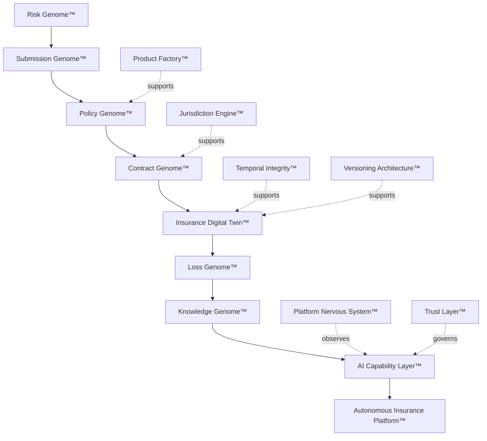
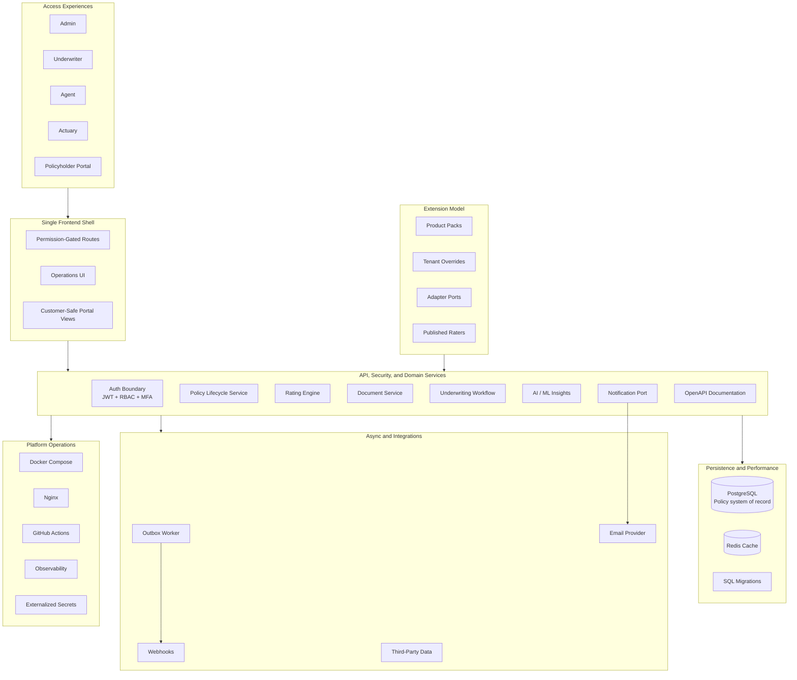
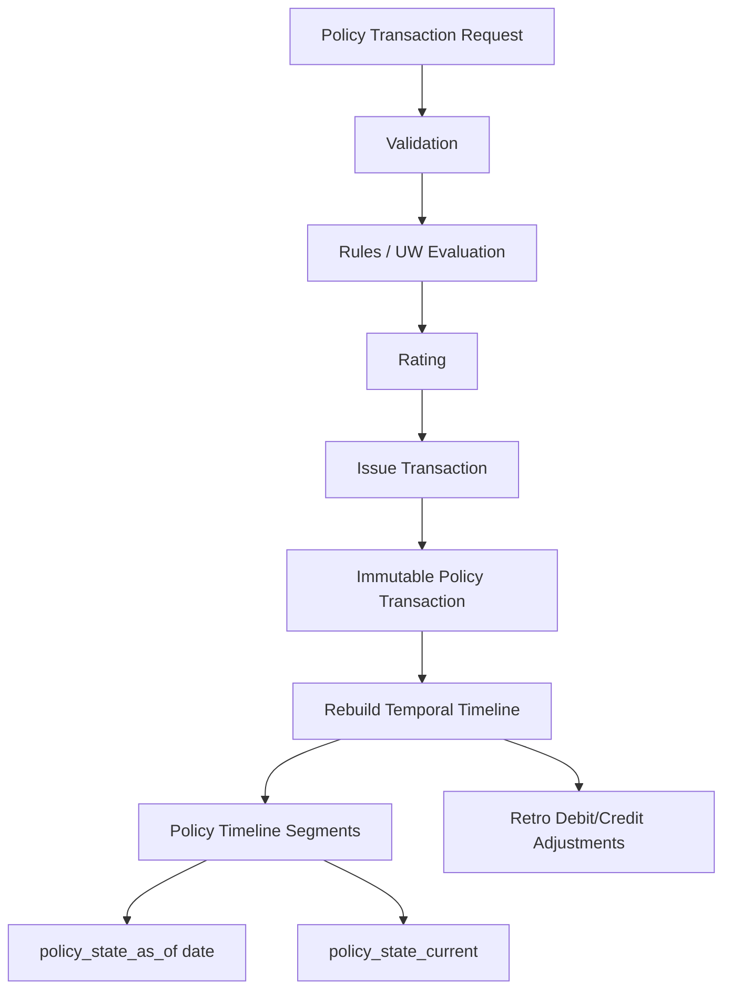
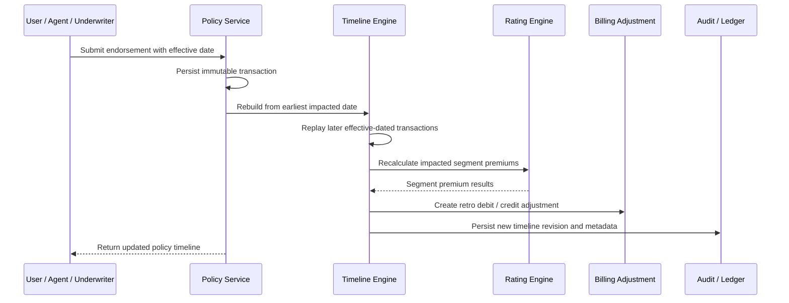
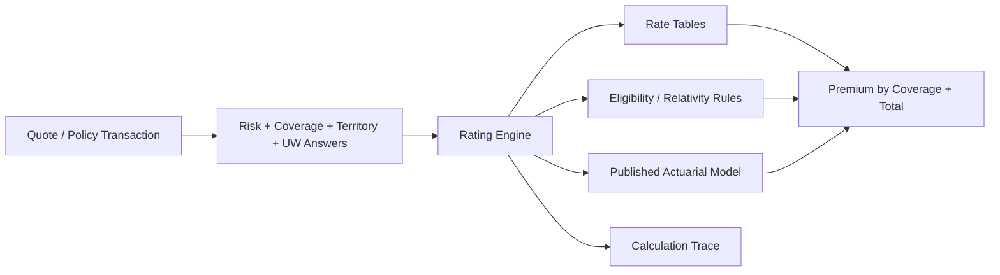
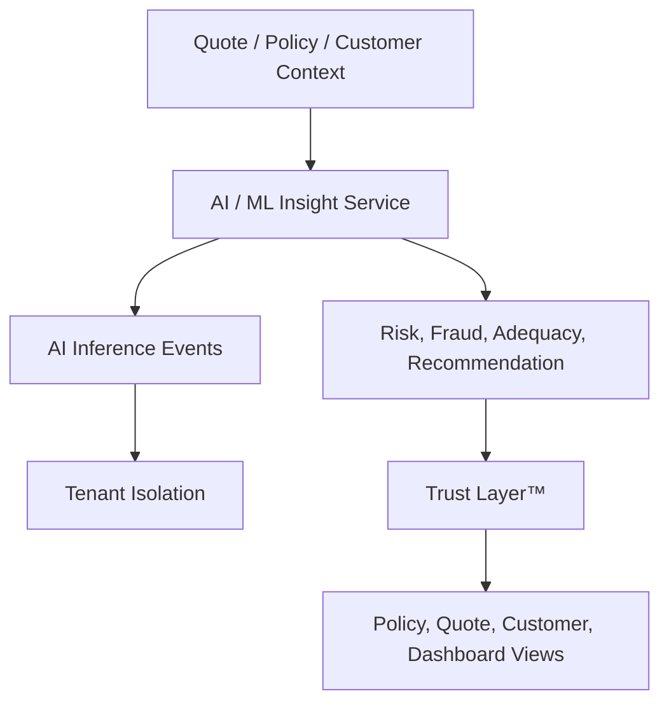
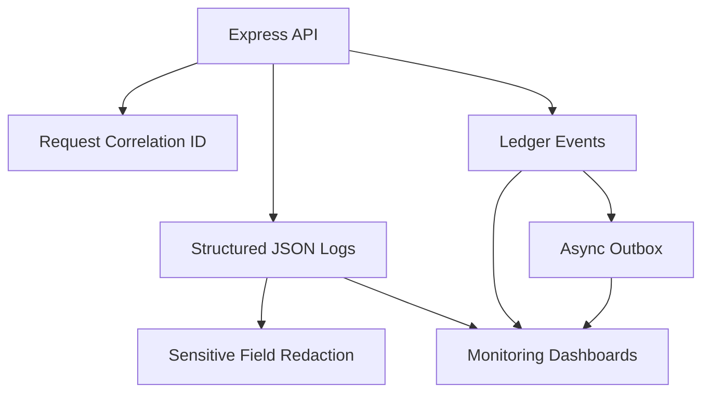

# GIPA v1.0 Diagram Alignment Guide

This document aligns the existing LatticePolicy architecture diagrams and documentation with the frozen GIPA v1.0 framework for use in the book *Building AI-Native Global Insurance Platforms*.

## Purpose

LatticePolicy is the practical reference implementation for selected GIPA v1.0 concepts. The book remains vendor-neutral and framework-oriented, while LatticePolicy demonstrates how many of the concepts can be implemented in an open-source policy administration framework.

## Source Architecture Observations

The current LatticePolicy architecture already supports several GIPA-aligned ideas:

- Carrier-extensible property and casualty policy administration.
- Multi-tenant policy lifecycle APIs.
- Quote intake, underwriting review, rating, bind, issue, endorse, cancel, reinstate, and renew workflows.
- Product packs and tenant configuration.
- Unified internal operations and customer portal architecture.
- PostgreSQL persistence and Redis-backed caching.
- Docker-based local deployment and cloud deployment examples.
- Explicit extension points for rating, underwriting rules, documents, payments, integrations, and events.
- Effective-dated immutable policy transaction processing.
- Outbox-backed asynchronous event delivery.
- AI/ML insights with persisted inference events.
- Structured logging and observability hooks.

## GIPA v1.0 Core Framework

## Diagram Alignment Matrix

| GIPA Diagram | GIPA Concept | Existing LatticePolicy Evidence | Book Usage |
|---|---|---|---|
| D-001 GIPA Master Architecture | End-to-end framework | Current component architecture shows access experiences, frontend shell, API/domain services, persistence, async integrations, and operations. | Use as executive framework diagram; reference LatticePolicy as implementation example. |
| D-020 Policy Genome™ | Product metadata model | Product packs, coverage definitions, rating inputs, tenant overrides, forms, rules, and workflow/UW extension points. | Use to show how products are metadata rather than hard-coded behavior. |
| D-030 Contract Genome™ | Forms and legal contract structure | Document service supports quote summary, policy packets, ID cards, rating worksheets, and customer-safe PDFs. | Use as implementation note for forms, packets, and policy documents. |
| D-040 Temporal Integrity™ | Effective-date and as-of processing | Architecture describes immutable transactions, valid time, system time, timeline segments, and out-of-sequence endorsement replay. | Use as one of the strongest practical examples in the book. |
| D-054 Policy Domain Architecture | Policy lifecycle system of record | Policy lifecycle includes quote, bind, issue, endorse, cancel, reinstate, and renew. | Use as the centerpiece implementation diagram for Chapter 20. |
| D-055 Insurance Digital Twin™ | Versioned policy state | Policy state is derived from temporal timelines, transaction changes, ratings, coverages, forms, and documents. | Use as the implementation basis for Digital Twin reconstruction. |
| D-070 AI Capability Layer™ | AI as platform capability | AI/ML insights support risk score, fraud score, premium adequacy, recommendations, suggested actions, and policy/customer views. | Use in AI chapters as reference implementation direction. |
| D-075 Trust Layer™ | AI governance and control | AI inference events persist provider, model, version, request/response snapshots, actor, timestamp, and tenant isolation. | Use for AI Genome and AI auditability discussion. |
| D-080 Rating Engine Architecture | Independent rating capability | Rating engine uses rules, tables, pluggable calculators, published actuarial models, and calc trace. | Use for Chapter 30 diagram and ADR. |
| D-084 Hybrid Integration Architecture | APIs plus asynchronous events | Outbox pattern writes ledger events and asynchronously pushes durable messages with retry/backoff. | Use for Chapters 34–35. |
| D-100 Platform Nervous System™ | Observability | Structured JSON logging, request correlation IDs, optional monitoring stack, Pino, Loki, Grafana references. | Use for operations section diagrams. |
| D-112 Cloud Deployment / Active-Ready Architecture | Deployment portability | Cloud guide supports AWS, Azure, GCP logical components with containers, managed Postgres, Redis, secrets, HTTPS, CI/CD. | Use in cloud portability and deployment chapters. |

## LatticePolicy-Aligned GIPA Component Architecture

## Policy Domain and Temporal Integrity Diagram

## Out-of-Sequence Endorsement Flow

## Rating Engine Alignment Diagram

## AI Governance and Trust Alignment Diagram

## Platform Nervous System Alignment Diagram

## Manuscript Integration Guidance

### Chapter 7 — Introducing GIPA
Use the GIPA Master Architecture diagram and mention LatticePolicy as an open-source reference implementation that demonstrates several GIPA concepts.

### Chapter 14 — Versioning Architecture™
Use the effective-dated transaction model and out-of-sequence endorsement flow.

### Chapter 20 — Policy Domain Architecture
Use the Policy Domain and Temporal Integrity diagram as the flagship implementation flow.

### Chapter 30 — Rating Engine Architecture
Use the Rating Engine Alignment diagram to connect rating inputs, tables, rules, published actuarial models, calc trace, and premium outputs.

### Chapter 34 — Hybrid Integration Architecture
Use the outbox pattern diagram and explain durable event delivery with retries and backoff.

### Chapter 41 — Platform Nervous System™
Use the observability alignment diagram to connect structured logs, request IDs, ledger events, outbox, dashboards, and operations.

### Chapter 29 — AI Governance Architecture
Use the AI governance and trust alignment diagram to show persisted AI inference events and tenant-scoped auditability.

## Editorial Positioning

In the book, LatticePolicy should be described carefully:

> LatticePolicy is an open-source reference implementation that demonstrates selected GIPA v1.0 architecture patterns, including metadata-driven product packs, effective-dated policy transactions, role-scoped access experiences, rating explainability, outbox-based event delivery, and AI inference auditability.

Avoid positioning it as the only implementation of GIPA. The book should remain vendor-neutral and technology-independent.

## Next Diagram Work

Recommended next diagrams to convert into polished book figures:

1. GIPA Master Architecture.
2. LatticePolicy Component Architecture mapped to GIPA.
3. Effective-Dated Policy Transaction Architecture.
4. Out-of-Sequence Endorsement Replay Flow.
5. Rating Engine and Actuarial Workbench Architecture.
6. Outbox-Based Hybrid Integration Architecture.
7. AI Insight Governance and Auditability Architecture.
8. Platform Nervous System / Observability Architecture.
9. Cloud Deployment Logical Architecture.
10. Multi-Tenant Access-Based Experience Architecture.
